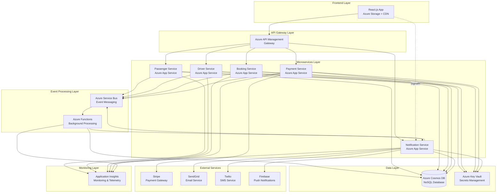
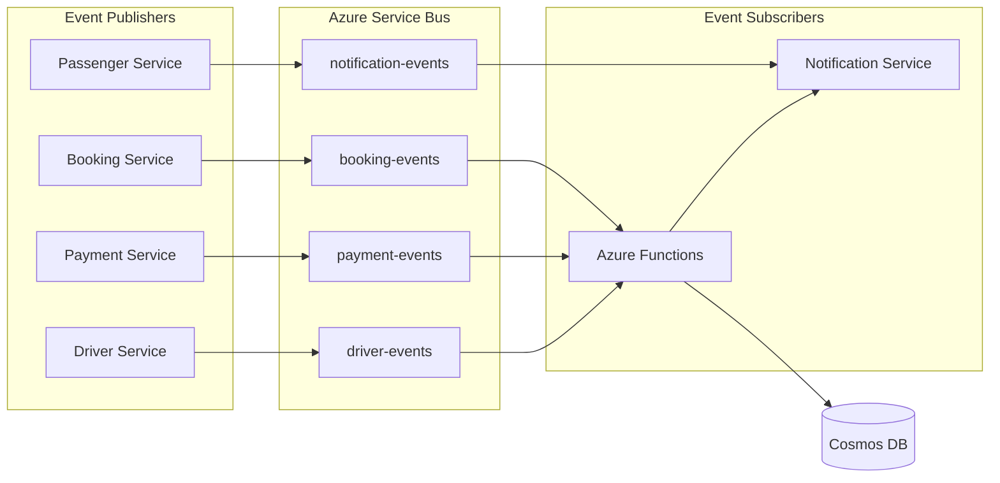
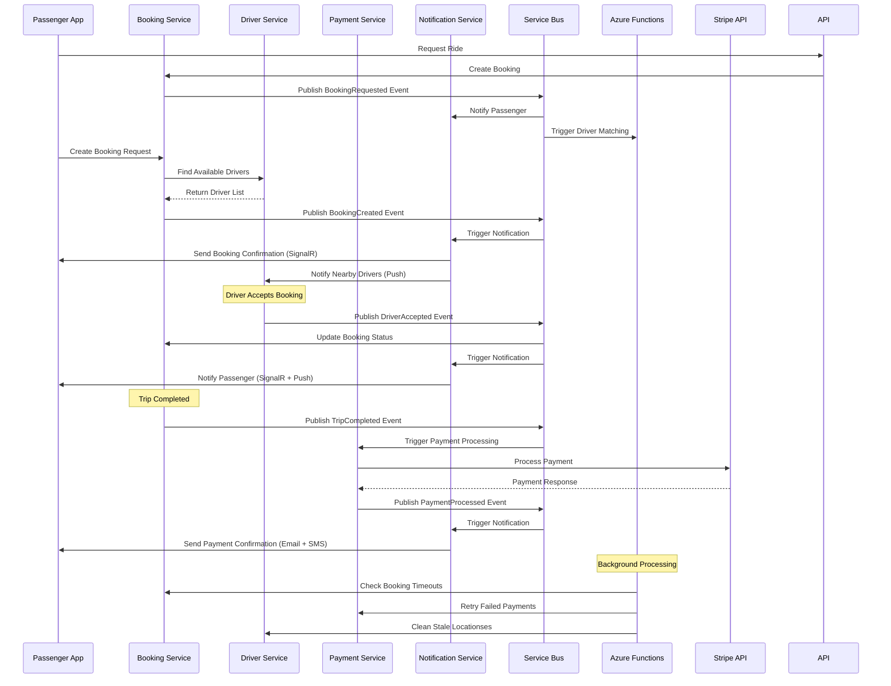
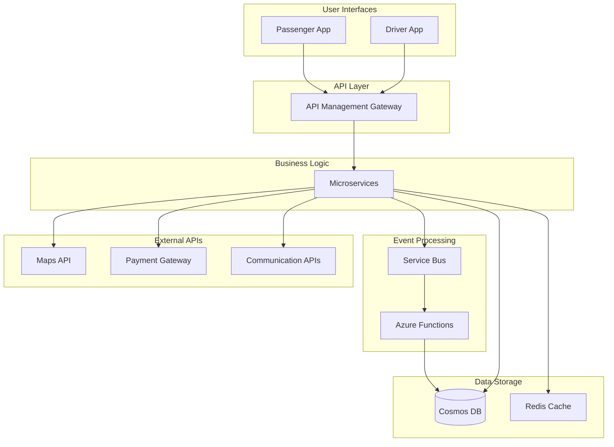
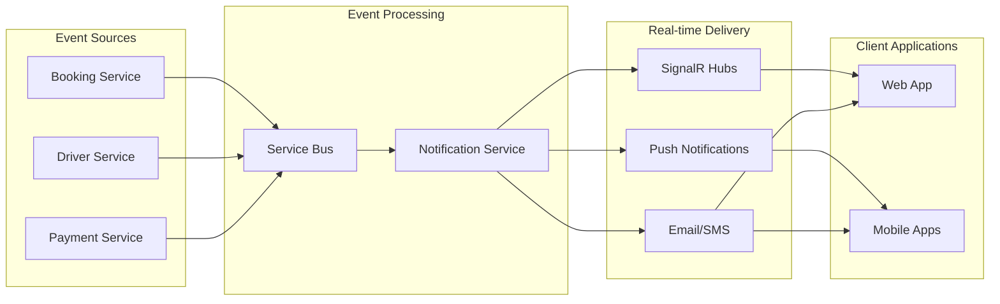
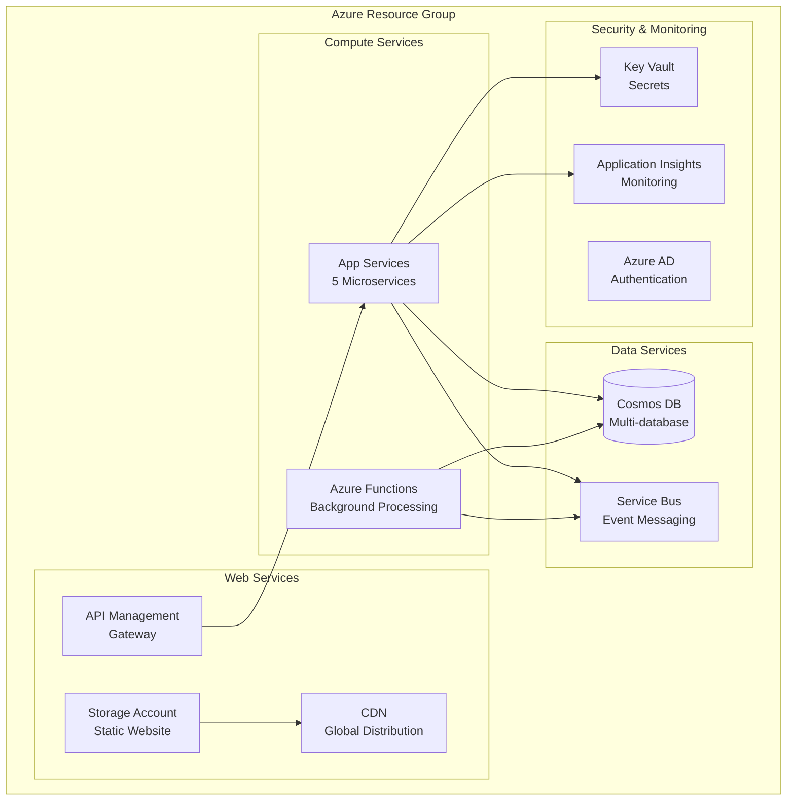

# Cab Service Architecture & Flow Diagrams

This document contains comprehensive diagrams explaining the Cab Service Event-Driven Microservice Architecture.

## Technology Stack Overview

### Backend Technologies
- **.NET 8** - All microservices built with latest .NET
- **Azure App Services** - Hosting platform for microservices
- **Azure Cosmos DB** - NoSQL database with partition key strategy
- **Azure Service Bus** - Event-driven messaging system
- **Azure Functions** - Background processing and scheduled tasks
- **SignalR** - Real-time communication hub
- **Azure Key Vault** - Secrets and configuration management
- **Application Insights** - Monitoring and telemetry

### Frontend Technologies
- **React 18** with TypeScript
- **Tailwind CSS** - Utility-first CSS framework
- **Axios** - HTTP client for API communication
- **SignalR Client** - Real-time communication
- **Azure MSAL** - Microsoft Authentication Library
- **React Query** - Server state management
- **React Router** - Client-side routing

### External Integrations
- **Stripe** - Payment processing
- **SendGrid** - Email notifications
- **Twilio** - SMS notifications
- **Firebase** - Push notifications

## 1. High-Level System Architecture



## 2. Microservices API Endpoints

### Passenger Service API
- `GET /api/passengers/{id}` - Get passenger profile
- `POST /api/passengers` - Register new passenger
- `PUT /api/passengers/{id}` - Update passenger profile
- `DELETE /api/passengers/{id}` - Delete passenger
- `GET /api/passengers/{id}/profile` - Get detailed profile
- `POST /api/passengers/{id}/verify` - Verify passenger identity
- `GET /api/passengers/search` - Search passengers

### Driver Service API
- `GET /api/drivers/{id}` - Get driver profile
- `POST /api/drivers` - Register new driver
- `PUT /api/drivers/{id}` - Update driver profile
- `DELETE /api/drivers/{id}` - Delete driver
- `POST /api/drivers/{id}/verify` - Verify driver documents
- `POST /api/drivers/{id}/status` - Update driver availability
- `POST /api/drivers/{id}/location` - Update driver location
- `GET /api/drivers/nearby` - Find nearby drivers
- `GET /api/drivers/{id}/profile` - Get detailed profile

### Booking Service API
- `POST /api/bookings` - Create new booking
- `GET /api/bookings/{id}` - Get booking details
- `PUT /api/bookings/{id}/cancel` - Cancel booking
- `PUT /api/bookings/{id}/accept` - Driver accepts booking
- `PUT /api/bookings/{id}/start` - Start trip
- `PUT /api/bookings/{id}/complete` - Complete trip
- `GET /api/bookings/passenger/{passengerId}` - Get passenger bookings
- `GET /api/bookings/driver/{driverId}` - Get driver bookings
- `POST /api/bookings/estimate-fare` - Calculate fare estimate
- `GET /api/bookings/nearby-drivers` - Find available drivers
- `PUT /api/bookings/{id}/rate` - Rate completed trip

### Payment Service API
- `POST /api/payments` - Process payment
- `GET /api/payments/{id}` - Get payment details
- `GET /api/payments/booking/{bookingId}` - Get booking payments
- `POST /api/payments/{id}/retry` - Retry failed payment
- `POST /api/payments/{id}/refund` - Process refund
- `GET /api/payments/passenger/{passengerId}` - Get passenger payments
- `GET /api/payments/driver/{driverId}` - Get driver payments
- `POST /api/payments/webhook/stripe` - Stripe webhook handler
- `GET /api/payments/{id}/status` - Get payment status

### Notification Service API
- `POST /api/notifications` - Send notification
- `GET /api/notifications/{id}` - Get notification details
- `GET /api/notifications/user/{userId}` - Get user notifications
- `PUT /api/notifications/{id}/read` - Mark notification as read
- `PUT /api/notifications/user/{userId}/read-all` - Mark all as read
- `DELETE /api/notifications/{id}` - Delete notification
- `POST /api/notifications/bulk` - Send bulk notifications
- `GET /api/notifications/user/{userId}/unread-count` - Get unread count
- `POST /api/notifications/schedule` - Schedule notification
- `GET /api/notifications/templates` - Get notification templates

## 3. Event-Driven Flow Architecture



## 4. Azure Functions Background Processing

### BookingTimeoutFunction
- **Trigger**: Timer (every 5 minutes)
- **Purpose**: Handle booking timeouts and expired bookings
- **Actions**: Cancel expired bookings, notify passengers, update driver availability

### PaymentRetryFunction
- **Trigger**: Timer (every 10 minutes)
- **Purpose**: Retry failed payments and process pending refunds
- **Actions**: Retry failed Stripe payments, process refund requests

### DriverLocationFunction
- **Trigger**: Timer (every 2 minutes)
- **Purpose**: Clean up stale driver location data
- **Actions**: Remove inactive drivers from location tracking

## 5. Complete Booking Flow



## 4. Data Flow Architecture



## 5. Security & Authentication Flow

```mermaid
graph TB
    subgraph "Client Applications"
        React[React App]
        Mobile[Mobile Apps]
    end
    
    subgraph "Identity Provider"
        AAD[Azure AD/Entra ID]
    end
    
    subgraph "API Gateway"
        APIM[API Management<br/>JWT Validation]
    end
    
    subgraph "Microservices"
        Services[Protected APIs<br/>Role-based Authorization]
    end
    
    React --> AAD
    Mobile --> AAD
    AAD --> React
    AAD --> Mobile
    
    React --> APIM
    Mobile --> APIM
    
    APIM --> Services
    
    Note over APIM: "Validates JWT tokens<br/>Enforces rate limits<br/>API policies"
    Note over Services: "Role-based access<br/>Passenger, Driver, Admin"
```

## 6. Real-time Communication Flow



## 7. Azure Infrastructure Overview


