# CabService Endpoint Calling Diagrams

This document contains detailed Mermaid diagrams showing all endpoint calling patterns in the CabService architecture.

## 1. Frontend to Backend API Calls

### Passenger App Flow
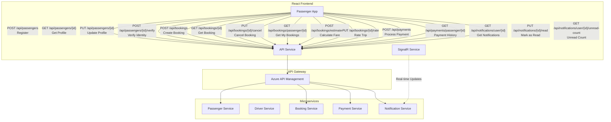

### Driver App Flow
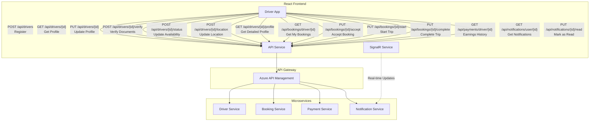

## 2. Inter-Microservice Communication

### Booking Service Internal Calls
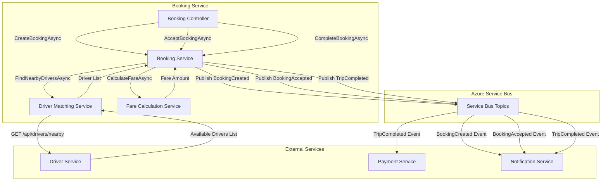

### Payment Service Integration Flow
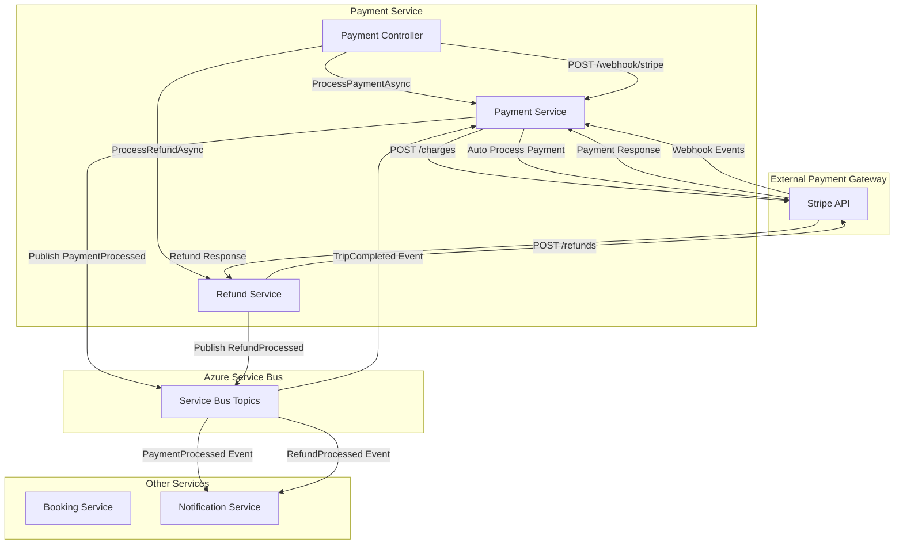

## 3. Notification Service Communication Hub

### Multi-Channel Notification Flow
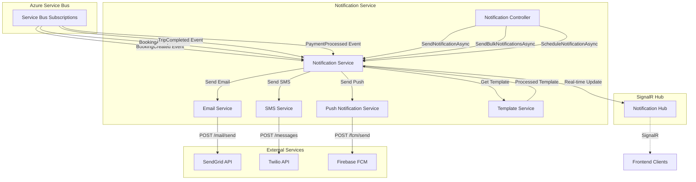

## 4. Azure Functions Background Processing

### Scheduled Functions Flow
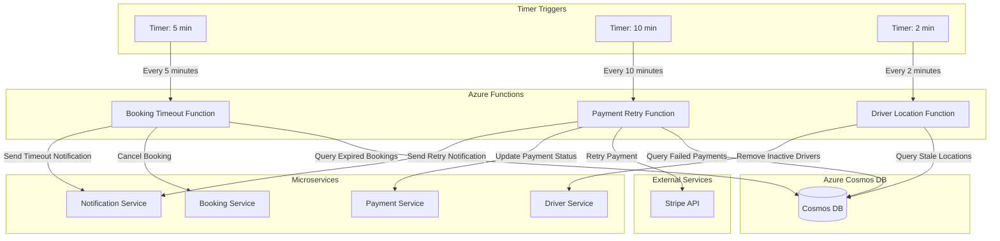

## 5. Complete End-to-End Booking Flow

### Passenger Books a Ride
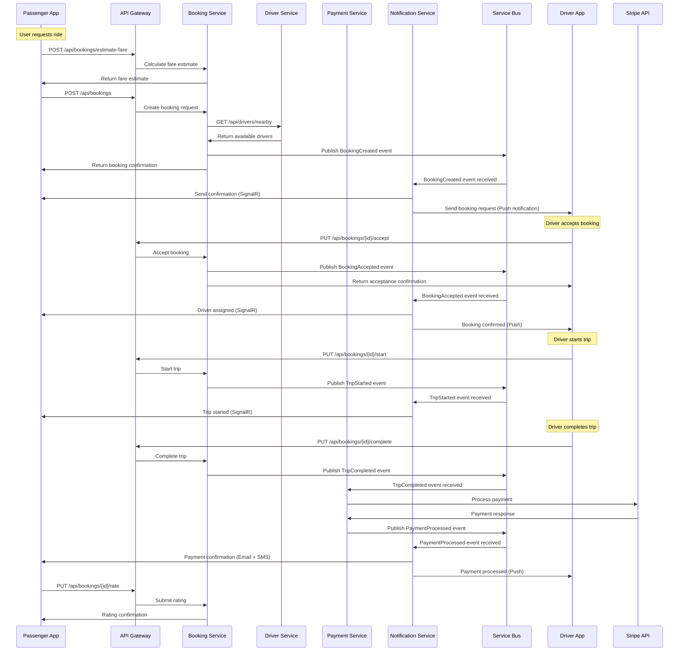

## 6. Error Handling and Retry Patterns

### Payment Failure Recovery Flow
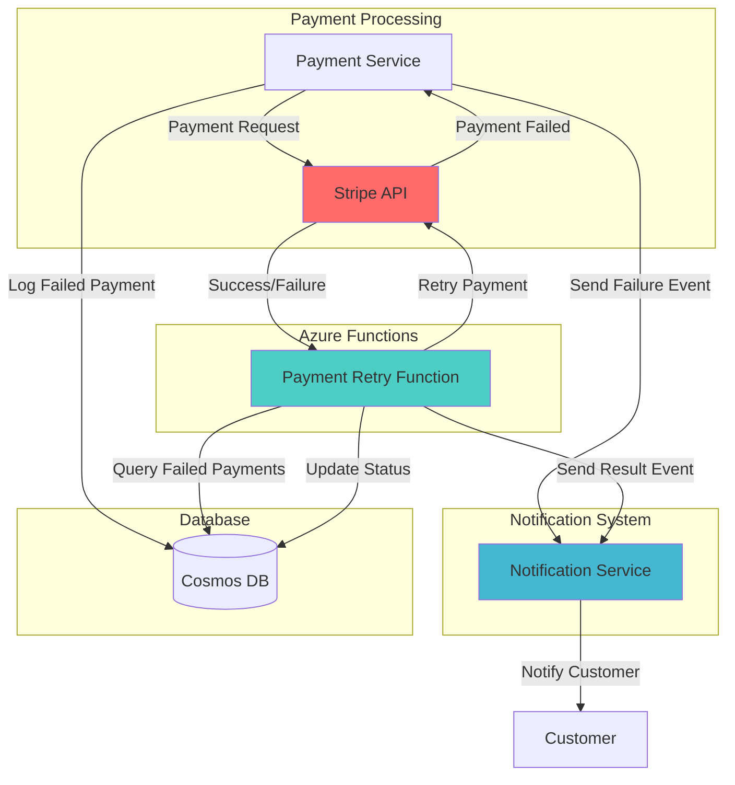

## 7. Authentication and Authorization Flow

### Azure MSAL Authentication
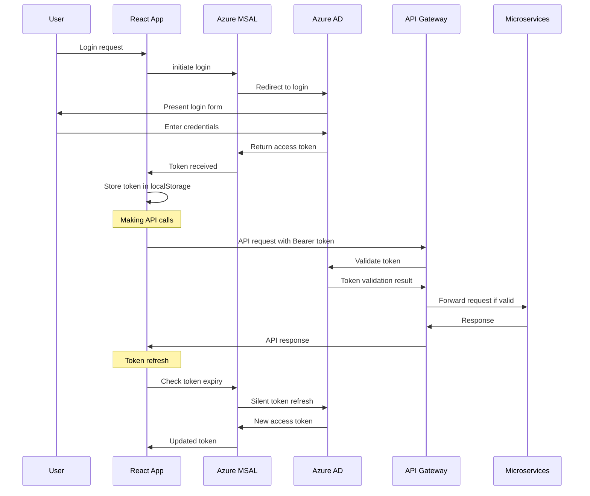

## 8. Real-Time Communication with SignalR

### SignalR Hub Connections
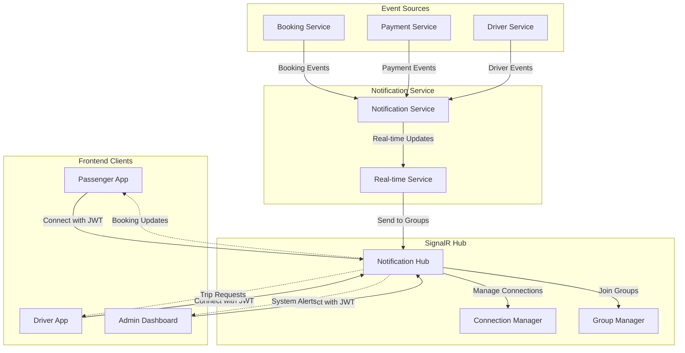

## 9. Data Access Patterns

### Cosmos DB Partition Strategy
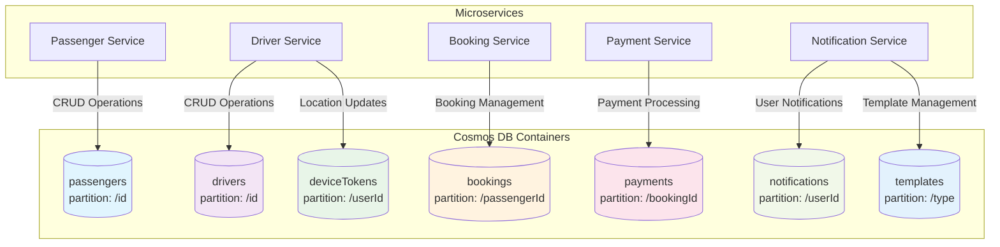

## 10. External Service Integration Patterns

### Third-Party Service Calls
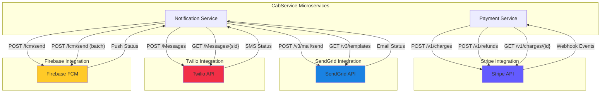

## 11. API Gateway Routing Patterns

### Azure API Management Routing
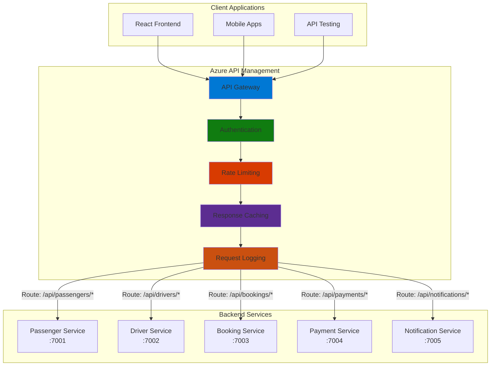

---

## How to Generate PNG Images from Mermaid Diagrams

### Method 1: Using Mermaid CLI
```bash
# Install Mermaid CLI
npm install -g @mermaid-js/mermaid-cli

# Generate PNG from markdown file
mmdc -i Endpoint-Calling-Diagrams.md -o diagrams/ -t dark -b white
```

### Method 2: Using Online Mermaid Editor
1. Visit https://mermaid.live/
2. Copy each diagram code block
3. Paste into the editor
4. Click "Export" → "PNG"
5. Download the generated image

### Method 3: Using VS Code Extension
1. Install "Mermaid Preview" extension
2. Open the markdown file
3. Right-click on diagram → "Export as PNG"

### Recommended Naming Convention
- `01-frontend-backend-calls.png`
- `02-inter-service-communication.png`
- `03-notification-hub.png`
- `04-azure-functions-flow.png`
- `05-end-to-end-booking.png`
- `06-error-handling.png`
- `07-authentication-flow.png`
- `08-signalr-realtime.png`
- `09-cosmos-db-patterns.png`
- `10-external-services.png`
- `11-api-gateway-routing.png`
```
